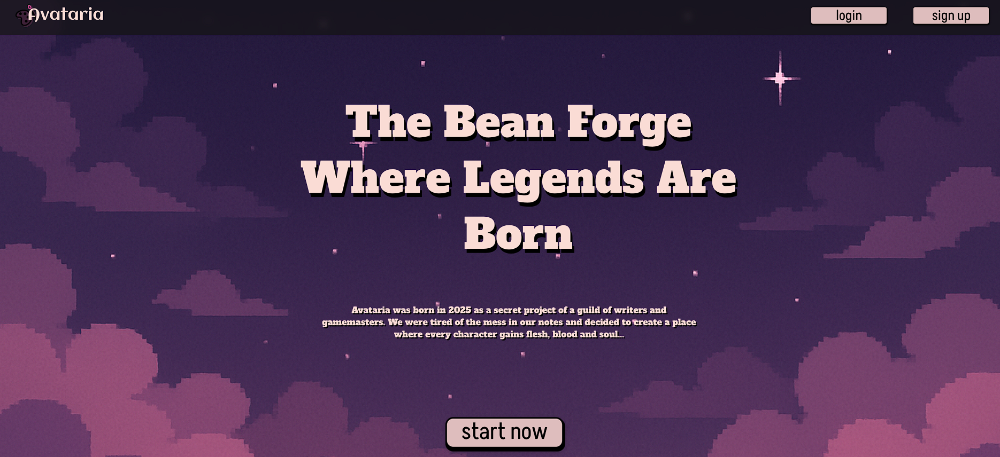
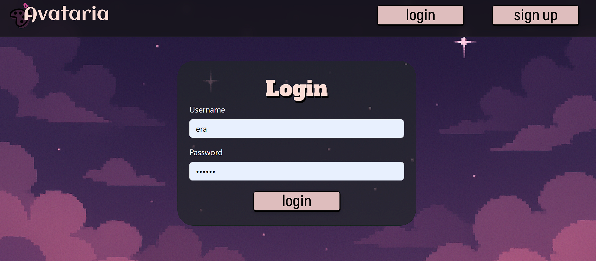
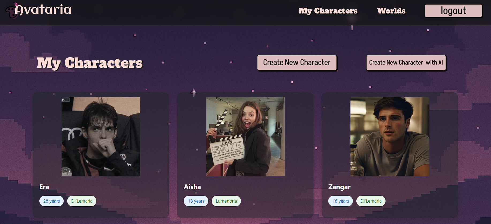
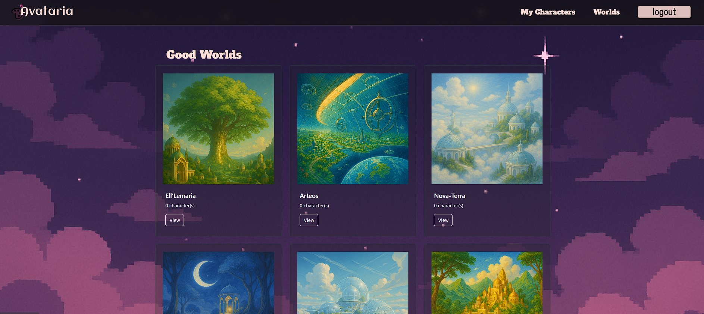
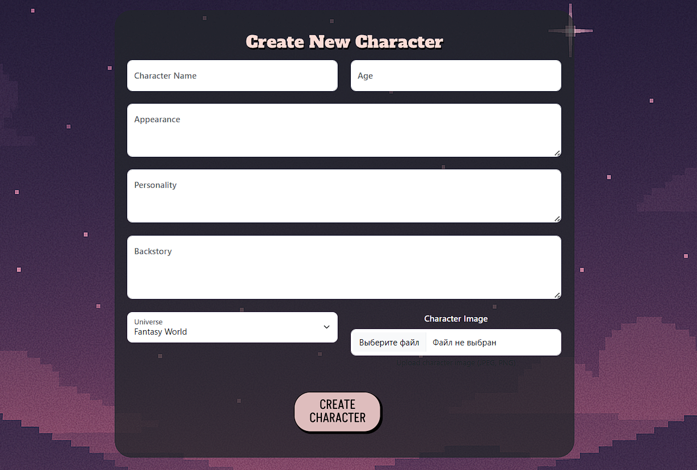
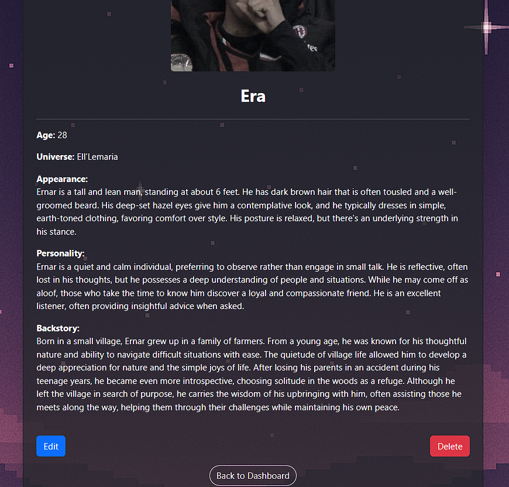
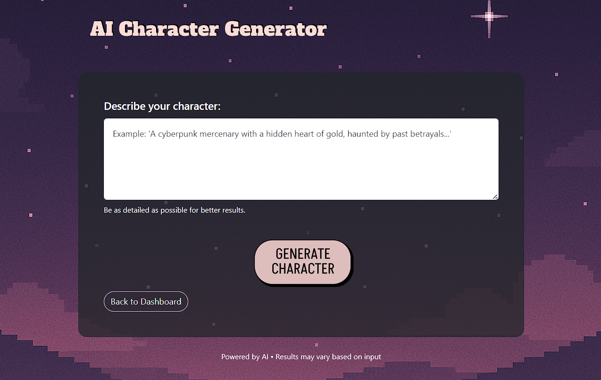

# Avataria - Flask Full-Stack Web Application

    

---

## 📚 Project Description

**Avataria** is a full-featured web application built with Flask that allows users to create, manage, and explore fictional characters in multiple universes.

It supports user authentication, CRUD operations for characters, image uploads, and AI-powered character generation with **OpenAI integration**.

---

## ✨ Main functions

- Registration and login with password hashing
- Session management (automatic logout after 5 minutes)
- Create, edit, and delete characters
- Uploading character images
- Connections between users, characters, and universes
- Adaptive interface using Bootstrap 5
- Implementation of architecture through Flask Blueprints
- Fully object-oriented code
- AI integration with OpenAI for description generation and character chat 

---

## 🛠️ Technology stack

- **Backend:** Python 3, Flask, Flask-WTF, Flask-SQLAlchemy
- **Frontend:** HTML5, CSS3, Bootstrap 5, Jinja2 Templates
- **Database:** SQLite
- **AI:** OPEN-AI
- **Version Control:** Git + GitHub

---
## 🤖 OpenAI Integration

- Generate rich character descriptions based on prompts  
- Talk to your characters using AI-powered chat  
- OPENAI_API_KEY=your_openai_api_key_here

---
## 🖥️ Screenshots
### Home page

### Login page

### Dashboard

### Worlds

### Character Creation

### Character Profile

### AI Chat Creator

---

## ⚙️ Project installation and launch

1. Clone the repository:
``bash
git clone https://github.com/narerken/avataria .git
2. cd endtermProject
3. pip install -r requirements.txt
4. python app.py